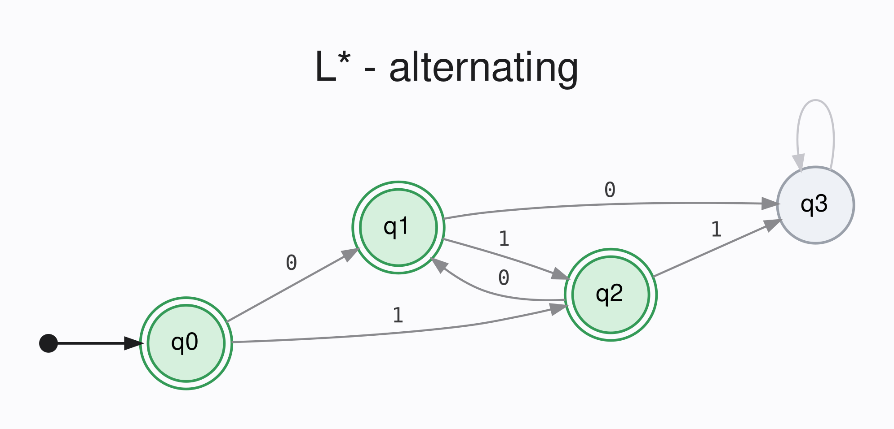
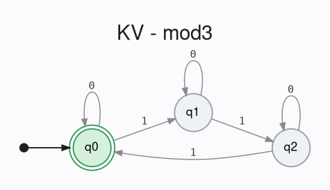
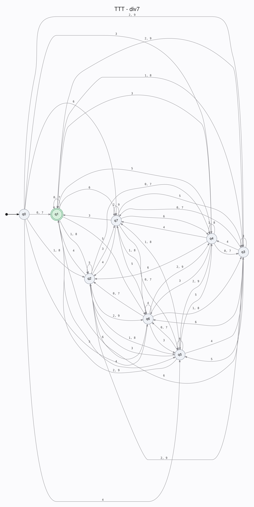

# lstar-rocq

A collection of formally-verified implementations of [automata learning](https://wcventure.github.io/Active-Automata-Learning/) algorithms.

| Algorithm | Resources | Proofs |
| --- | --- | --- |
| L* | [Angluin, 1987](https://doi.org/10.1016/0890-5401(87)90052-6), [Lecture Notes](https://www.tifr.res.in/~shibashis.guha/courses/diwali2021/L-starMalharManagoli.pdf) | [Lstar.v](theories/Lstar.v) |
| Kearns-Vazirani | [Kearns-Vazirani, 1994](https://doi.org/10.7551/mitpress/3897.003.0009), [Balle, 2010](https://borjaballe.github.io/papers/zulu10.pdf) | [KV.v](theories/KV.v) |
| TTT | [Isberner et al., 2014](https://doi.org/10.1007/978-3-319-11164-3) | [TTT.v](theories/TTT.v) |

[These notes](https://www.overleaf.com/read/jbftmjdhmyjd#a32216) summarize each of the main proof arguments and algorithm designs.

Functions return sigma types, so each sub-component of each algorithm provides a proof of correctness alongside its computational outputs.

## Layout

- [DFA.v](theories/DFA.v) - definitions for alphabets, regular languages, and DFAs, including the correctness properties of language encoding and minimality
- [Teacher.v](theories/DFA.v) - definitions for the Minimum Adequate Teacher model
- [ListLemmas.v](theories/ListLemmas.v) - miscellaneous lemmas about lists
- [RS.v](theories/RS.v) - a general-purpose implementation of Rivest-Schapire counterexample analysis, used in the implementations of L*, KV, and TTT
- [Teacher.ml](lib/Teacher.ml) - OCaml entrypoint for using the extracted library, provides a single module interface to instantiate all of the learning algorithms

## Installation

```bash
# Will install both lstar (the OCaml release) and lstar-rocq (the Rocq theory development)
opam install lstar
```

## Building

```bash
# Install Dependencies
opam switch create rocq 5.3.0
opam pin add rocq-runtime 9.1.0
opam install rocq-prover dune

# Clone and build
git clone https://github.com/CharlesAverill/lstar-rocq && cd lstar-rocq
make # will build lstar-rocq, extract, then build lstar
```

> [!WARNING]
> By default, this project will build with [ExtrOcamlNatInt](https://rocq-prover.org/doc/V9.1.0/stdlib/Stdlib.extraction.ExtrOcamlNatInt.html), which is unsound in the event of overflow.
> Unless your DFAs could potentially include 2^63 states, this shouldn't be a problem.
> If you'd like me to support [ExtrOcamlNatBigInt](https://rocq-prover.org/doc/V9.1.0/stdlib/Stdlib.extraction.ExtrOcamlNatBigInt.html) instead, please [open an issue](https://github.com/CharlesAverill/lstar-rocq/issues/new/choose) and I'll get on it.

## Example

An example execution is provided in [alternating.ml](examples/alternating.ml).
The target language is alternating bit strings (e.g., "01", "10", "101", "0101", etc.).
Running `dune exec lstar.alternating` will start the learning algorithm, report that it has found a DFA that encodes the language, and then run some test cases for bit strings of length 3:

```
$ dune exec lstar.alternating
DFA found                          
Input       Expected  Got       Correct 
[000]       false     false     Y
[001]       false     false     Y
[010]       true      true      Y
[011]       false     false     Y
[100]       false     false     Y
[101]       true      true      Y
[110]       false     false     Y
[111]       false     false     Y
Accuracy: 8/8
```

Examples `lstar.div7` and `lstar.mod3` show the learning of DFAs for decimal strings divisible by 7, and binary strings where the number of `1`s is divisible by 3.






